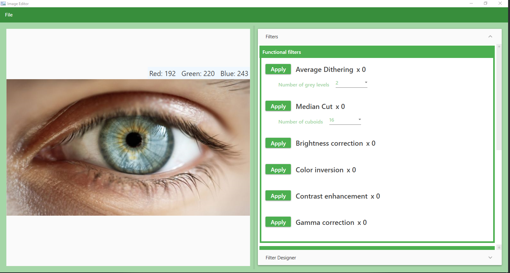
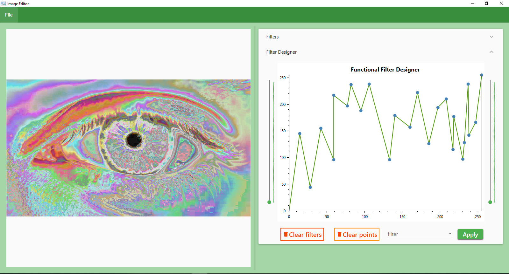
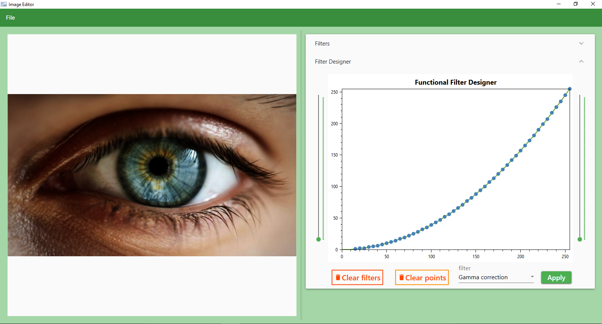

# Project for Computer Graphics

## Version 1.0
### Functional filters:
* Brightness
* Color inversion
* Contrast
* Gamma correction
* Median cut
* Average dithering

### Convolution filters:
* Blur
* Emoss
* Gaussian smoothing
* Median
* Sharpen
* Edge detection(diagonal)

### Functional filter designer:

